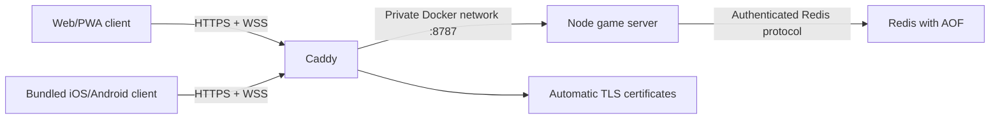

# Production architecture

Status: proposed production v1
Last updated: 2026-07-10

## Assumptions

- Thoughtless Labs operates the service and owns the permanent application ID `com.thoughtlesslabs.hideandseekcards`.
- Version 1 runs on one Linux VPS. One application process is intentional; horizontal scaling is not yet supported.
- The web client and game API use one public HTTPS origin. Native apps bundle the client and connect to that same origin.
- Players use anonymous, signed sessions. There are no accounts, passwords, advertisements, purchases, free-form chat, or user-uploaded media.
- Redis data is operational game state, not a permanent player history. The default room snapshot TTL is 24 hours.

Confirm these assumptions before a production or store release. A change to any of them requires a privacy and threat-model review.

## Topology

Only Caddy publishes host ports. Redis and the Node service are reachable only through Docker networks.

## Components

| Component | Responsibility | Durable data |
| --- | --- | --- |
| Vite/React client | Rendering, local preferences, solo play, reconnection, public state projection | Player card, preferences, and session token in local device storage |
| Caddy | TLS, HTTP/2 and HTTP/3, security headers, compression, WebSocket proxying, access logs | TLS state in named Docker volumes |
| Node game server | Anonymous sessions, validation, matchmaking, authoritative turns, bots, rate limiting, state projection | None directly |
| Redis | Room snapshots and recovery after application restart | AOF/RDB files in a named Docker volume, with per-room TTLs |

The application image contains both `dist/` and `server-dist/`. The server serves the web app and API from one origin, while Caddy proxies every request to the server. Socket.IO upgrades on `/socket.io` require no separate proxy route.

## Online session and game flow

1. The client posts a display name and bundled avatar identifier to `POST /v1/session/anonymous`.
2. The server validates the profile and returns a signed, expiring anonymous session token. The signing secret never enters the client image.
3. The client opens Socket.IO with that token. The server derives the player identity from the signature rather than trusting action payloads.
4. Matchmaking and room commands carry a unique command ID. Turn commands also carry the expected state version and turn ID.
5. The room manager serializes commands per room, applies the authoritative game engine, saves a snapshot, and emits a player-safe projection.
6. After a connection interruption or app resume, the client reconnects and requests the latest authoritative snapshot. Offline moves are not queued.

## State and integrity boundaries

- Hidden card ownership remains server-side until a card is revealed. Clients receive temporary card selection tokens, not stable private card IDs.
- The server validates phase, actor, target, expected version, turn ID, and command ID before changing state.
- In-process room queues prevent concurrent writes inside the single server process.
- Signed tokens identify a session but are not an account system. They should not contain secrets or personal information beyond the chosen nickname and avatar ID.
- All client input is untrusted, including room codes, reactions, timestamps, origins, and reconnect metadata.

## Security controls

- Caddy terminates TLS and adds CSP, HSTS, frame, MIME, referrer, and permissions-policy headers.
- `ALLOWED_ORIGINS` is an exact allowlist. Wildcards are forbidden in production.
- Session creation and game actions are rate-limited. Payload size is capped by the server.
- A player card may hold at most four simultaneous sockets by default. Engine.IO reserves capacity before a transport handshake completes, so unauthenticated or simultaneous raw WebSockets cannot bypass the single-process global ceiling; the per-player limit is enforced after session authentication. Transport socket IDs remain runtime-only and are stripped from persisted snapshots.
- Session expiry is enforced when a socket connects and while it remains connected. An expired socket receives a retryable `UNAUTHORIZED` error and is disconnected so the client can obtain a fresh anonymous session.
- Redis requires a random password, has no published port, and is isolated on an internal Docker network.
- The application runs as a non-root user with a read-only root filesystem and all Linux capabilities dropped.
- Secrets live only in the untracked VPS `.env` file or a future secret manager. Variables beginning with `VITE_` are public build-time values and must never contain secrets.
- The native app loads bundled `dist` assets. Production configuration must never add Capacitor `server.url`, cleartext traffic, or mixed-content exceptions.

## Availability and recovery

- `/healthz` is liveness only. `/readyz` reports initialization, `snapshotStore`, and a `persistence` state of `durable`, `degraded`, or `ephemeral`.
- Redis uses AOF with `appendfsync everysec` plus periodic RDB snapshots. Room data and its Redis index entry change in one transaction. At most roughly one second of acknowledged Redis persistence can be lost during an abrupt host failure.
- A cold-start process that has not successfully loaded Redis remains HTTP 503 on `/readyz` while `/healthz` and the bundled Solo/web shell remain available. Session creation and Socket.IO handshakes return retryable failures until authoritative state has loaded, so an apparently empty room set cannot accept online play. One bounded recovery probe runs at a time, every five seconds by default; when Redis returns, it validates and loads persisted rooms without replacing newer in-process room IDs, member ownership, or room-code mappings. Connected sessions whose rooms are recovered after a later runtime outage are reattached and receive a fresh snapshot without a process restart.
- After one successful authoritative load, a later Redis outage is different: `/readyz` remains HTTP 200 with `degraded: true`, `persistence: "degraded"`, and `snapshotStore: "memory-fallback"`. Every Redis operation has a bounded deadline; a stalled connection is destroyed before the in-memory fallback acknowledges play. Saves and delete tombstones are buffered in-process, serialized, and drained on a fresh connection before the response returns to `redis`. Existing games can continue, but crash/restart durability is lost until recovery. Returning 503 in this state would incorrectly conflate reduced durability with an unplayable process and could encourage automation to restart away the buffered state.
- Container and Caddy upstream health checks use `/healthz`; `/readyz` remains directly observable for readiness alerts. Alert separately on prolonged degraded persistence or a cold-start `/readyz` failure.
- Graceful application replacement closes Engine.IO transports rather than sending a terminal Socket.IO namespace disconnect. Existing clients automatically reconnect and request the authoritative Redis-backed room from the replacement process.
- Room snapshots expire after `GAME_SNAPSHOT_TTL_SECONDS`, defaulting to 86,400 seconds. The session token default lifetime is 30 days.
- The VPS, its local Docker volumes, and one application process remain single points of failure. Encrypted off-host backups and restore tests are operational requirements.

## Scaling boundary

Do not set `app` replicas above one. Per-room command queues and Socket.IO room membership currently live in one process. Horizontal scaling requires all of the following first:

- a distributed Socket.IO adapter or equivalent event bus;
- distributed room locks or an atomic command log;
- shared rate limiting;
- idempotent recovery across workers;
- load-balancer connection strategy and multi-node failure tests.

Vertical scaling and a larger Redis/VPS are the supported first-stage capacity path.

## Native delivery boundary

`capacitor.config.ts` points to `dist`, so every store build contains a reviewed client bundle. The backend URL is public build configuration supplied through `VITE_GAME_SERVER_URL`. Changing the server URL or web code in a native release requires rebuilding and submitting a new store version; remote code replacement is intentionally not part of this architecture.

Native `ios/` and `android/` projects are generated in this workspace. Signing identities, the final production domain, final icon/orientation review, deep-link association data, and store ownership remain release gates. See [NATIVE_RELEASE.md](./NATIVE_RELEASE.md).
